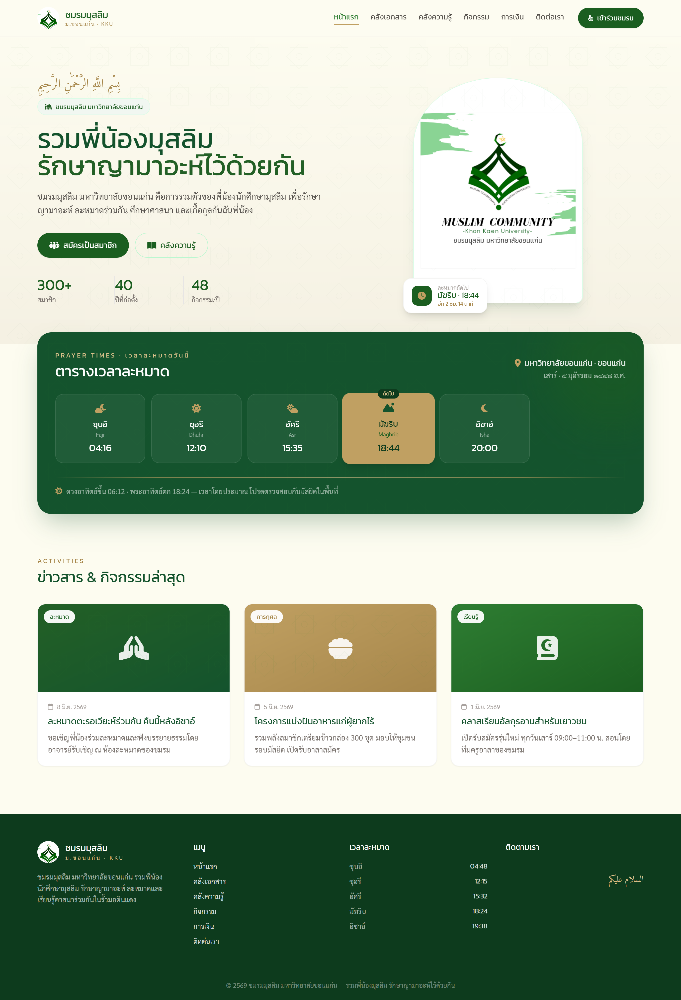
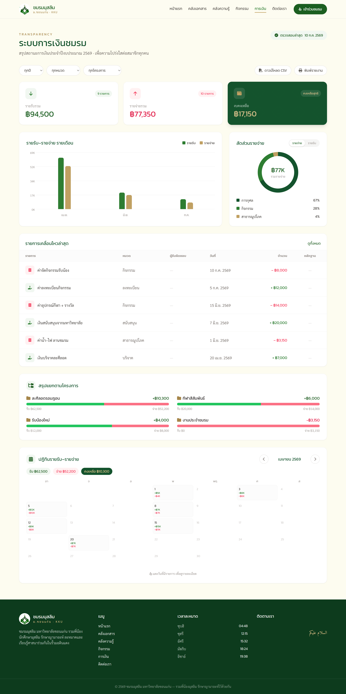
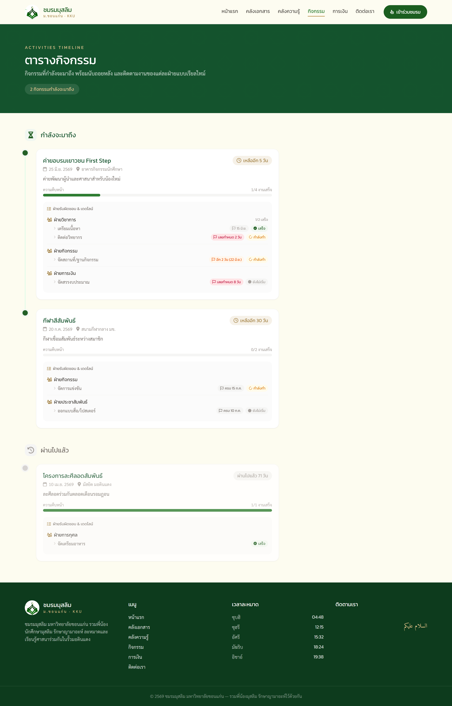
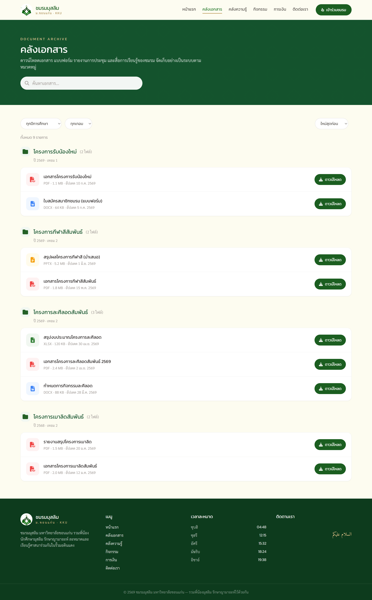
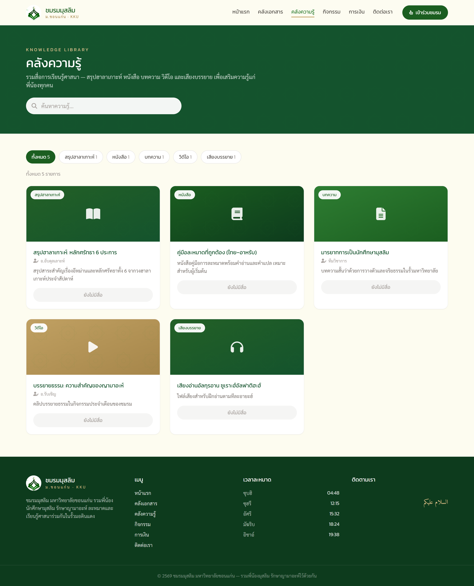
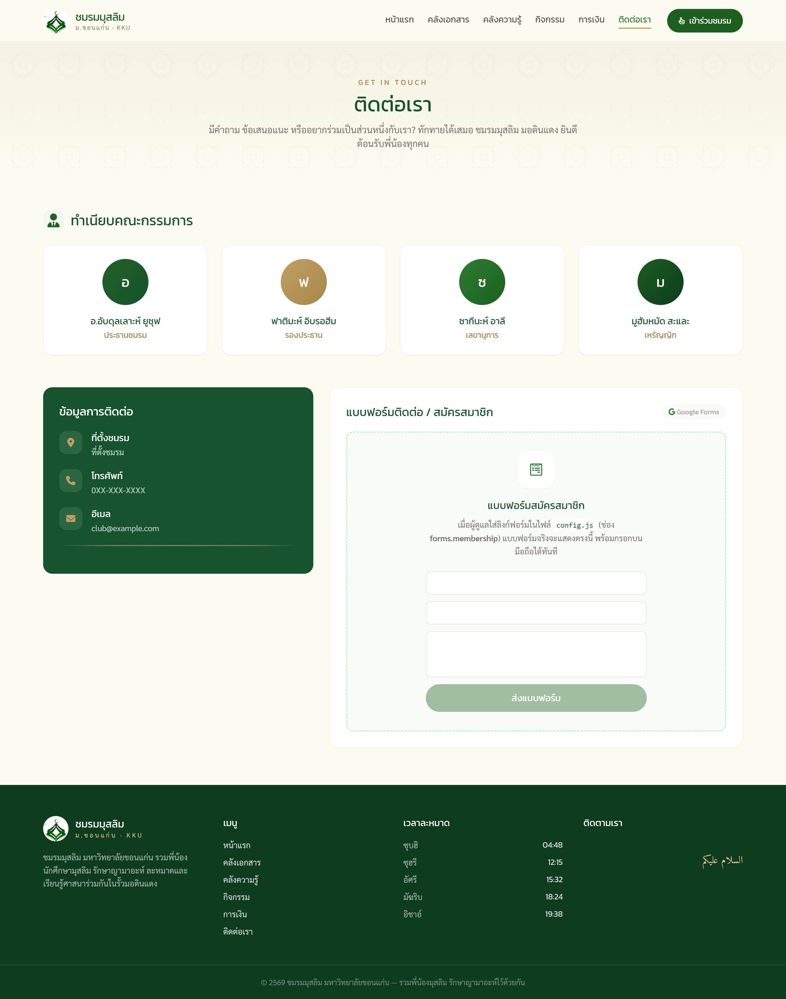
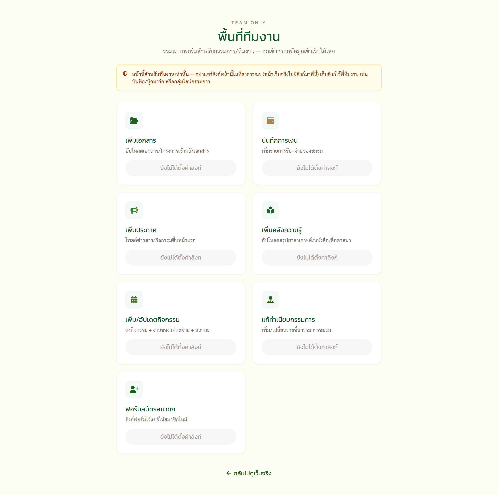
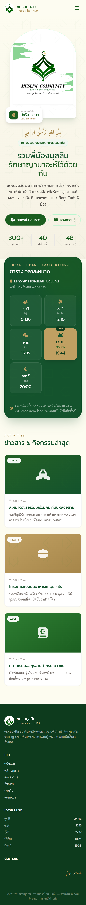

# Muslim Community KKU — Club Website

A complete, in-production website for the **Muslim Student Club, Khon Kaen University** — with an unusual twist: the entire content-management system runs on **Google Sheets & Forms**, so non-technical committee members can update documents, finances, announcements, knowledge media, and activities **without ever touching code**.


🔗 **Live demo:** https://muslimclub-kku.netlify.app

> A real project for a student club. **No framework, no backend server, no monthly cost** — and it can be handed to next year's non-technical volunteers without a developer.



---

## The problem

A student club needed a public website that:

- Shows **prayer times**, activities, a **document archive**, a knowledge library, and **transparent finances**.
- Can be **maintained by rotating, non-technical volunteers** every year.
- Costs **nothing** to host and run.

Hiring a CMS or running a server was overkill for a volunteer-run club with no budget. So the "backend" became **Google Sheets** — a tool every committee member already knows how to use.

## The approach — Google Sheets as a no-code CMS

```
   Committee fills a Google Form        Static site (HTML + vanilla JS)
        (from a phone)                  fetches the published CSV on load
              │                                     ▲
              ▼                                      │
        Google Sheet  ──────────  published as CSV ──┘
        (responses)                                  │
              │                                       ▼
        Google Drive                     renders tables / charts /
       (files, receipts)                 calendars / timelines
                                                      │
                                                      ▼
                                    Netlify · static · free · HTTPS · PWA
```

- **Frontend:** plain HTML + Tailwind CSS + **vanilla JavaScript** — small, self-contained modules, **no build framework**.
- **"Backend":** Google Sheets (published to CSV) for data, Google Forms for entry, Google Drive for files/receipts/images.
- **Live data:** the site reads the sheets on every load, so content updates appear **without redeploying**.
- **Graceful by design:** every module falls back to sample data when a sheet isn't connected or the network drops.

## Screenshots

| Finance dashboard | Activities timeline |
|---|---|
|  |  |

| Document archive | Knowledge library |
|---|---|
|  |  |

| Contact & committee | Private team form hub |
|---|---|
|  |  |

<p align="center">
  
  <br><em>Responsive & installable as an app (PWA) on phones / tablets</em>
</p>

## Features

| Page | Highlights |
|------|-----------|
| 🕌 **Home / Prayer times** | Live daily times for the club's location via the [Aladhan API](https://aladhan.com/), `localStorage` caching, next-prayer countdown, Thai Hijri date, Friday Jumu'ah handling |
| 📂 **Documents** | Grouped by project / academic year / term, search + filter, file-type icons, Google Drive **preview & download** |
| 📚 **Knowledge library** | Religious learning media (lecture summaries, books, articles, video, audio); **in-browser viewer** opens PDFs/images/video in a lightbox without leaving the site |
| 🗓️ **Activities** | Timeline split into *upcoming* (with countdown) and *past*; per-department task tracking with **per-task deadlines** colour-coded by urgency (overdue / due-soon / done) |
| 💰 **Finance** | Income/expense summary, monthly bar chart, expense donut, **clickable daily calendar** (built for Ramadan iftar tracking), per-project breakdown, per-year selector, CSV export, and a **formatted printable report** with signature lines + receipt links |
| 📣 **Announcements** | News cards on the home page with images (auto-handles Google Drive image links) |
| 👥 **Committee** | Auto-sorted by role, click-to-copy phone/email, Facebook links, generated avatars |
| ✉️ **Contact** | Editable info + embedded membership Google Form |
| 🔐 **Team page** | A private, unlisted hub collecting every input form for committee use (intentionally excluded from the PWA and search engines) |

## Engineering highlights

Things in here I'm proud of as an engineering exercise:

- **No-framework architecture** — one small JS module per feature, namespaced on `window`, no bundler or build step for the app code. Easy for the next maintainer to read.
- **Tolerant data layer** — a shared CSV fetch + parser with **fuzzy column-name matching**, so a non-technical user renaming a sheet header doesn't break the page.
- **Robust date parsing** — handles ISO, `DD/MM/YYYY`, Thai month names, **and the Buddhist Era** (auto-converts BE → CE) since Google Forms in Thai emit Buddhist years.
- **Google Drive normalization** — converts share links into preview / download / image URLs (images via `lh3` with `referrerpolicy="no-referrer"` to dodge Drive's referer block).
- **In-browser document viewer** — a reusable lightbox for PDFs, images, and YouTube, with a download fallback.
- **Finance dashboard from raw transactions** — bar chart, donut (hand-built with `conic-gradient`), clickable calendar, and a print-only official report via `@media print` — all computed client-side from a flat transaction list.
- **Offline-capable PWA** — web app manifest + a **network-first service worker** scoped to same-origin assets only, so the live Google-Sheets data always stays fresh while the app shell still works offline.
- **Graceful degradation** — sample data renders when a sheet is empty or the network fails; the site never shows a broken page.
- **Zero runtime CDN risk for styling** — Tailwind is compiled to a local file, so the layout never depends on a CDN being reachable.

## Tech stack

- **HTML5**, **Tailwind CSS** (compiled locally — no CDN dependency at runtime)
- **Vanilla JavaScript** — module-per-feature pattern, no framework (~13 small files)
- **Google Sheets** (published CSV) + **Google Forms** + **Google Drive** as the data layer
- **Aladhan API** for prayer times
- **PWA** — web manifest + service worker (installable, offline-capable)
- **Netlify** for static hosting (HTTPS, free)

## Project structure

```
├── index.html               # main single-page app (6 sections)
├── team.html                # private form hub for the committee (noindex)
├── manifest.webmanifest     # PWA manifest (name, icons, theme)
├── sw.js                    # service worker (offline shell + fresh live data)
├── css/
│   ├── style.css            # custom styles + print styles
│   ├── tailwind.css         # compiled Tailwind (generated)
│   └── tailwind-input.css   # Tailwind entry file
├── js/
│   ├── config.example.js    # ⭐ configuration template (copy to config.js)
│   ├── sheets.js            # CSV fetch + tolerant parser
│   ├── main.js              # SPA navigation
│   ├── content.js           # home-page text from config
│   ├── prayer.js            # prayer times (Aladhan API + cache)
│   ├── documents.js         # document archive
│   ├── knowledge.js         # knowledge library
│   ├── events.js            # activities timeline + deadlines
│   ├── finance.js           # finance dashboard + printable report
│   ├── announcements.js     # news cards
│   ├── committee.js         # committee directory
│   ├── contact.js           # contact info + membership form
│   └── viewer.js            # reusable PDF/image/video lightbox
├── assets/img/              # logo, artwork, PWA icons
├── google-sheets-templates/ # CSV templates + setup guides (Thai)
├── docs/screenshots/        # screenshots for this README
├── tailwind.config.js       # Tailwind theme + content sources
└── คู่มือ-README.md          # maintainer's guide (Thai)
```

## Getting started

This is a static site — no install required.

```bash
# 1. clone
git clone https://github.com/ARCHEMETIS/muslim-club-website.git
cd muslim-club-website

# 2. add your config (or leave it to see the sample-data demo)
cp js/config.example.js js/config.js

# 3. serve locally (any static server works)
python -m http.server 8000
# open http://localhost:8000
```

Connect your own Google Sheets / Forms by pasting their links into `js/config.js`.
The full setup guide (Thai) is in `คู่มือ-README.md` and `google-sheets-templates/`.

### Installing as an app (PWA)

Once deployed over HTTPS, the site can be installed to a phone or tablet home screen:

- **iPhone / iPad:** open in Safari → Share → *Add to Home Screen*
- **Android:** open in Chrome → menu → *Install app*

### Rebuilding Tailwind (only if you change classes)

```bash
npx tailwindcss@3 -c tailwind.config.js -i css/tailwind-input.css -o css/tailwind.css --minify
```

## License

[MIT](LICENSE) — free to use and learn from.

---

*Made with care for the Muslim Community, Khon Kaen University. 🕌*
